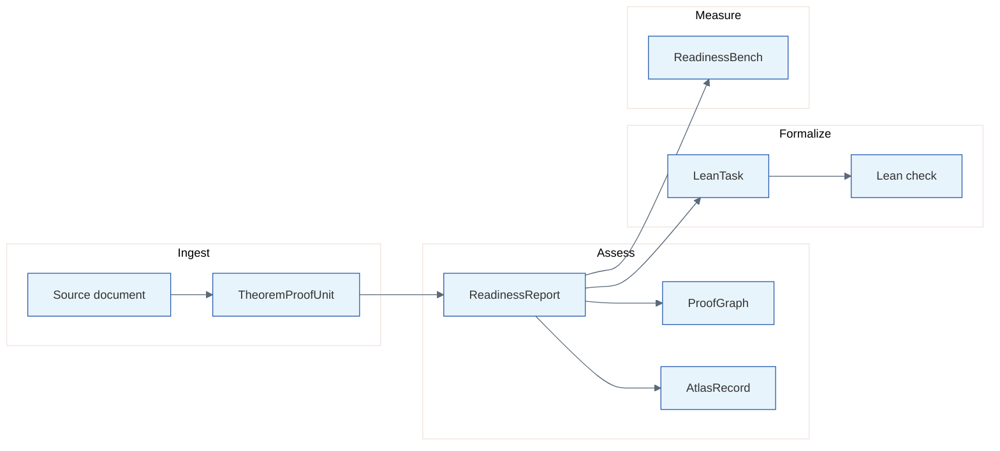

<div align="center">

# Formalization Readiness Engine

**Measure how far informal proofs are from Lean 4: structured readiness reports, mathlib alignment, and reproducible benchmarks.**

[](https://github.com/fraware/formalization-readiness-engine/actions/workflows/ci.yml)
[](lean/README.md)
[](requirements.txt)
[](tests/)
[](releases/v0.2.0/)
[](LICENSE)

[Quick start](#quick-start) · [Architecture](#architecture) · [Contribute](#how-to-contribute) · [Documentation](#documentation) · [Issues](https://github.com/fraware/formalization-readiness-engine/issues)

</div>

<br>

> Informal proofs are written for people, not proof assistants. FRE ingests theorem and proof units from LaTeX or author-permitted notes, surfaces ambiguity and gaps, proposes **mathlib** alignment candidates, and emits formalization-ready **LeanTask** packages with **ProofGraph** and **Atlas** records — each validated against typed schemas before review.

FRE is a research and engineering foundation for measuring formalization readiness. It is not end-to-end automated theorem proving. Model outputs stay **candidate** artifacts until schema validation, semantic checks, and human review complete.

---

## At a glance

<table>
<tr>
<td align="center" width="25%">
<strong>334</strong><br>unit tests<br><sub>CI on every push</sub>
</td>
<td align="center" width="25%">
<strong>43</strong><br>benchmark items<br><sub>11 gold · 1 silver · 31 bronze</sub>
</td>
<td align="center" width="25%">
<strong>30</strong><br>corpus units<br><sub>5 catalog sources</sub>
</td>
<td align="center" width="25%">
<strong>2</strong><br>reference examples<br><sub>finite tree · category theory</sub>
</td>
</tr>
</table>

| | |
|:--|:--|
| **Lean toolchain** | Lean 4.8.0 + mathlib v4.8.0; both reference LeanTasks verified 2026-06-14 ([status](lean/README.md#verification-status)) — L1 scaffolds use `sorry`, not completed proofs |
| **Public release** | [`releases/v0.2.0/`](releases/v0.2.0/) manifest, checksums, and committed exports |
| **Repository** | [github.com/fraware/formalization-readiness-engine](https://github.com/fraware/formalization-readiness-engine) |

---

## What you get

<table>
<thead>
<tr>
<th width="28%">Capability</th>
<th>Why it matters</th>
</tr>
</thead>
<tbody>
<tr>
<td><strong>Readiness reports</strong></td>
<td>Structured assessment of formalization readiness with source-grounded spans and explicit blockers.</td>
</tr>
<tr>
<td><strong>ProofGraph</strong></td>
<td>Dependency-aware view of proof steps and gaps, validated against semantic rules.</td>
</tr>
<tr>
<td><strong>Atlas records</strong></td>
<td>Evidence-backed alignment between informal statements and formalization obstacles.</td>
</tr>
<tr>
<td><strong>LeanTask packages</strong></td>
<td>Planning artifacts and Lean skeletons (L0–L2) checkable locally with <code>lake env lean</code>. Generated L1 output uses <code>sorry</code>; checks verify imports and statement shape, not proof completion.</td>
</tr>
<tr>
<td><strong>mathlib alignment</strong></td>
<td>Declaration index lookup and multi-dimensional candidate matching.</td>
</tr>
<tr>
<td><strong>ReadinessBench</strong></td>
<td>Tiered benchmark (bronze / silver / gold) for scoring extraction against expert-reviewed truth.</td>
</tr>
<tr>
<td><strong>Corpus export</strong></td>
<td>Ingest author-permitted LaTeX; export full-text or metadata-only shareable units.</td>
</tr>
<tr>
<td><strong>Demos</strong></td>
<td>Reproducible end-to-end runs on two reference examples — offline or model-backed.</td>
</tr>
<tr>
<td><strong>Review workflow</strong></td>
<td>Reviewer guide, submission template, rubric, API, and static review UI.</td>
</tr>
</tbody>
</table>

Every stage produces a versioned, typed artifact (Pydantic + JSON Schema). Nothing enters trusted benchmark data without validation and review.

---

## Quick start

**Prerequisites:** Python 3.11+, Git. Optional: [elan](https://github.com/leanprover/elan) + Lean 4.8.0 for local Lean checking (offline demo skips Lean by default). See [lean/README.md](lean/README.md#verification-status) for last verified build and the `sorry` scaffold policy.

### Linux / macOS

```bash
git clone https://github.com/fraware/formalization-readiness-engine.git
cd formalization-readiness-engine
make setup
make test
make validate-examples
make demo
```

### Windows (PowerShell)

```powershell
git clone https://github.com/fraware/formalization-readiness-engine.git
cd formalization-readiness-engine
.\scripts\dev.ps1 setup
.\scripts\dev.ps1 test
.\scripts\dev.ps1 validate-examples
.\scripts\dev.ps1 demo
```

The offline demo runs the full pipeline on both reference examples without OpenAI. Outputs: `artifacts/generated/demo_run/offline/`. See [docs/DEMO.md](docs/DEMO.md) for a stage-by-stage walkthrough.

<details>
<summary><strong>Optional — model-backed extraction</strong> (requires <code>OPENAI_API_KEY</code>)</summary>

<br>

```bash
make setup-models
make demo-live
```

Committed reference scores and error analysis for the two live examples: [`docs/evidence/live_extraction_v0.2/`](docs/evidence/live_extraction_v0.2/). Score live outputs with `make run-readinessbench PREDICTIONS_DIR=artifacts/generated/demo_run/live` or `make record-live-extraction` after a fresh run.

Windows:

```powershell
.\scripts\dev.ps1 setup-models
.\scripts\dev.ps1 demo-live
```

On Windows miniconda, if OpenAI calls fail with SSL errors, run `python -m pip install pip-system-certs` first (see [docs/DEMO.md](docs/DEMO.md)).

</details>

---

## Architecture

FRE behaves like a compiler front end for informal mathematics. Each node is a validated artifact.



| Example | Path | Topic |
|:--|:--|:--|
| Finite tree | [`examples/finite_tree/`](examples/finite_tree/) | Edge count in a finite tree |
| Category theory pullback | [`examples/category_theory_pullback/`](examples/category_theory_pullback/) | Pullback transport along an equivalence |

---

## Project layout

```
formalization-readiness-engine/
├── packages/fre_core/          # Core: schemas, ingestion, extraction, validation, CLI
├── examples/                   # Reference artifact stacks
├── benchmarks/readinessbench/  # Tiered benchmark manifest and fixtures
├── corpus/                     # Source catalog, LaTeX inputs, ingested units
├── lean/                       # Pinned Lean 4.8.0 project + generated tasks
├── apps/
│   ├── api/                    # FastAPI validation and alignment endpoints
│   ├── review-ui/              # Static review interface
│   └── docs-site/              # MkDocs config (sources in docs/)
├── docs/                       # Architecture, demo, release, review guides
├── tests/                      # Unit and integration tests (333+)
├── releases/v0.2.0/            # Release manifest, checksums, and committed exports
│   └── exports/                # ReadinessBench and Atlas JSONL (v0.2.0 bundle)
└── scripts/dev.ps1             # Windows equivalent of Makefile targets
```

On Windows: `.\scripts\dev.ps1 <target>` — e.g. `.\scripts\dev.ps1 export-schemas`.

<details>
<summary><strong>Common commands</strong></summary>

<br>

| Task | Linux / macOS | Windows |
|:--|:--|:--|
| Run tests | `make test` | `.\scripts\dev.ps1 test` |
| Offline demo | `make demo` | `.\scripts\dev.ps1 demo` |
| Single example | `make demo-finite-tree` | `.\scripts\dev.ps1 demo-finite-tree` |
| Validate examples | `make validate-examples` | `.\scripts\dev.ps1 validate-examples` |
| Export schemas | `make export-schemas` | `.\scripts\dev.ps1 export-schemas` |
| Ingest corpus | `make ingest-corpus` | `.\scripts\dev.ps1 ingest-corpus` |
| Validate benchmark | `make validate-readinessbench` | `.\scripts\dev.ps1 validate-readinessbench` |
| Run benchmark eval | `make run-readinessbench` | `.\scripts\dev.ps1 run-readinessbench` |
| Export public benchmark | `make export-public-benchmark` | `.\scripts\dev.ps1 export-public-benchmark` |
| Build docs | `make docs` | `pip install -r requirements-docs.txt` then `python -m mkdocs build -f apps/docs-site/mkdocs.yml` |
| Review API + UI | `make setup-api && make run-api` | `.\scripts\dev.ps1 setup-api` then `.\scripts\dev.ps1 run-api` |

Review UI: [http://127.0.0.1:8080](http://127.0.0.1:8080) · Docker stack: [docs/DOCKER.md](docs/DOCKER.md)

</details>

---

## How to contribute

Contributions are welcome. Build around **artifacts** — every feature should create, validate, render, evaluate, or document a typed output. Do not bypass the pipeline or write model output directly into trusted benchmark data.

**Get started in three steps**

| Step | Action |
|:--:|:--|
| 1 | `make setup && make test && make demo` — then read [docs/DEMO.md](docs/DEMO.md) |
| 2 | Browse [open issues](https://github.com/fraware/formalization-readiness-engine/issues) or open one with your idea |
| 3 | Fork, branch, keep changes focused, open a PR with description and test plan |

**Where help is especially valuable**

| Area | Focus |
|:--|:--|
| **Corpus** | Author-permitted LaTeX, catalog entries, shareable exports — [CORPUS_GOVERNANCE](docs/CORPUS_GOVERNANCE.md) |
| **ReadinessBench** | Bronze promotion, gold fixtures, evaluation — [benchmark README](benchmarks/readinessbench/README.md) |
| **Lean tasks** | Rendering, mathlib alignment, local checking — [lean/README](lean/README.md) |
| **Extraction** | Readiness reports, ProofGraph, Atlas quality behind the structured model client |
| **Review** | Validate reports with the reviewer guide — [REVIEWER_GUIDE](docs/review/REVIEWER_GUIDE.md) |
| **Documentation** | Architecture, demos, and release workflows in `docs/` |

CI runs tests, offline demo, example validation, public exports, and documentation build on every push and pull request.

---

## Documentation

| Document | Purpose |
|:--|:--|
| [docs/index.md](docs/index.md) | Documentation home |
| [docs/ARCHITECTURE.md](docs/ARCHITECTURE.md) | Pipeline, modules, workflows |
| [docs/DEMO.md](docs/DEMO.md) | End-to-end demo walkthrough |
| [docs/PUBLIC_RELEASE.md](docs/PUBLIC_RELEASE.md) | Public benchmark and Atlas exports |
| [docs/TECHNICAL_REPORT.md](docs/TECHNICAL_REPORT.md) | v0.2.0 release summary |
| [docs/DOCKER.md](docs/DOCKER.md) | Docker Compose and async jobs |
| [docs/CORPUS_GOVERNANCE.md](docs/CORPUS_GOVERNANCE.md) | Source catalog and release modes |
| [docs/OPENAI_USAGE.md](docs/OPENAI_USAGE.md) | Model-call conventions |
| [docs/review/REVIEWER_GUIDE.md](docs/review/REVIEWER_GUIDE.md) | External review workflow |

```bash
make docs    # built HTML → site/
```

---

## Citation

```text
Formalization Readiness Engine (v0.2.0).
https://github.com/fraware/formalization-readiness-engine
Release manifest: releases/v0.2.0/manifest.json
```

Questions: [GitHub Issues](https://github.com/fraware/formalization-readiness-engine/issues).

---

## License

This project is licensed under the [MIT License](LICENSE).