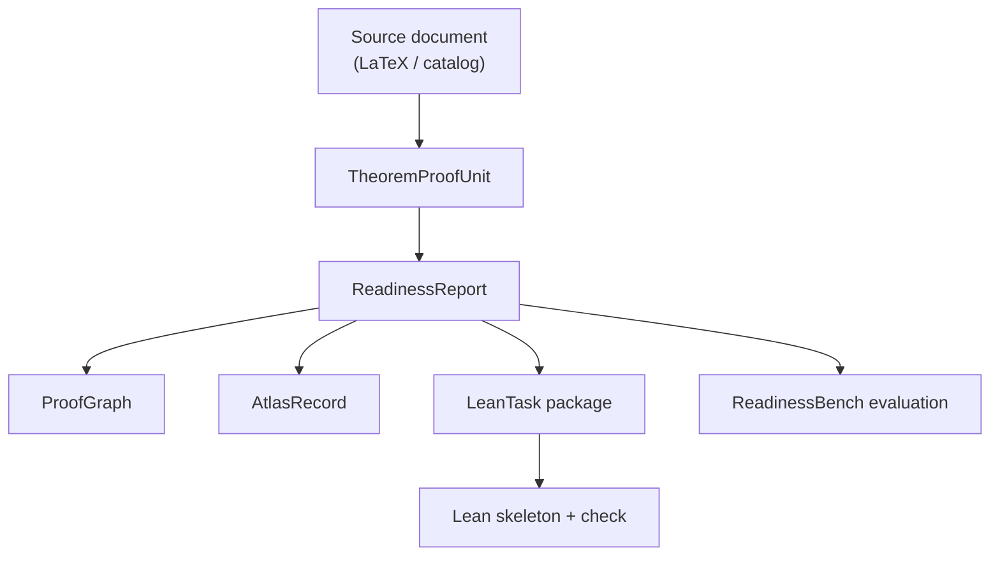

# Formalization Readiness Engine

[](https://github.com/fraware/formalization-readiness-engine/actions/workflows/ci.yml)
[](lean/README.md)
[](requirements.txt)

Informal mathematics is written for people, not proof assistants. Before investing weeks in a Lean 4 formalization, teams need to know whether a statement is well scoped, what prerequisites are missing, and how it might align with mathlib. The **Formalization Readiness Engine (FRE)** answers that question with a validated artifact pipeline: it ingests theorem and proof units from LaTeX or author-permitted notes, surfaces ambiguity and gaps, proposes mathlib alignment candidates, and emits formalization-ready **LeanTask** packages alongside **ProofGraph** and **Atlas** records.

FRE is a research and engineering foundation for measuring formalization readiness. It is not a claim of end-to-end automated theorem proving. Model outputs remain candidate artifacts until they pass schema validation, semantic validation, and human review.

---

## At a glance

| | |
|---|---|
| **Unit tests** | 165 (CI green on every push and pull request) |
| **ReadinessBench** | 43 items (11 gold, 1 silver, 31 bronze) |
| **Corpus** | 30 units from 5 catalog sources |
| **Reference examples** | Finite tree edge count, category theory pullback |
| **Lean pin** | Lean 4.8.0 + mathlib v4.8.0 |
| **Public release** | [`releases/v0.2.0/`](releases/v0.2.0/) |
| **Repository** | [github.com/fraware/formalization-readiness-engine](https://github.com/fraware/formalization-readiness-engine) |

---

## What you get

| Capability | Why it matters |
|---|---|
| **Readiness reports** | Structured assessment of whether an informal proof is ready to formalize, with source-grounded spans and explicit blockers. |
| **ProofGraph extraction** | Dependency-aware view of proof steps and gaps, validated against semantic rules. |
| **Atlas records** | Evidence-backed alignment between informal statements and formalization obstacles (the Formalization Gap Atlas). |
| **LeanTask packages** | Planning artifacts and Lean skeletons (L0–L2) that can be checked locally with `lake env lean`. |
| **mathlib alignment** | Declaration index lookup and multi-dimensional candidate matching against mathlib. |
| **ReadinessBench** | Tiered benchmark (bronze / silver / gold) for scoring readiness-report extraction against expert-reviewed truth. |
| **Shareable corpus export** | Ingest author-permitted LaTeX and export units with full-text or metadata-only release modes. |
| **Offline and live demos** | Reproducible end-to-end runs on two reference examples, with or without OpenAI. |
| **Review workflow** | Reviewer guide, submission template, usefulness rubric, API, and static review UI. |

Every stage produces a versioned, typed artifact (Pydantic schemas with JSON Schema export). Nothing enters trusted benchmark data without validation and review.

---

## Quick start (about 5 minutes)

**Prerequisites:** Python 3.11+, Git. Optional: Lean 4.8.0 for full Lean checking (the offline demo skips Lean by default).

### Linux and macOS

```bash
git clone https://github.com/fraware/formalization-readiness-engine.git
cd formalization-readiness-engine
make setup
make test
make validate-examples
make demo
```

### Windows (PowerShell)

```powershell
git clone https://github.com/fraware/formalization-readiness-engine.git
cd formalization-readiness-engine
.\scripts\dev.ps1 setup
.\scripts\dev.ps1 test
.\scripts\dev.ps1 validate-examples
.\scripts\dev.ps1 demo
```

The offline demo runs the full artifact pipeline on both reference examples without OpenAI or network access. Generated outputs land under `artifacts/generated/demo_run/offline/`. See [docs/DEMO.md](docs/DEMO.md) for a stage-by-stage walkthrough.

**Optional — model-backed extraction** (requires `OPENAI_API_KEY`):

```bash
make setup-models
make demo-live
```

On Windows: `.\scripts\dev.ps1 setup-models` then `.\scripts\dev.ps1 demo-live`.

---

## Architecture at a glance

FRE behaves like a compiler front end for informal mathematics. Each box is a validated artifact; arrows show the primary data flow.



**Reference examples** (hand-authored artifact stacks you can inspect today):

| Example | Path | Topic |
|---|---|---|
| Finite tree | [`examples/finite_tree/`](examples/finite_tree/) | Edge count in a finite tree |
| Category theory pullback | [`examples/category_theory_pullback/`](examples/category_theory_pullback/) | Pullback transport along an equivalence |

---

## Project layout

```text
formalization-readiness-engine/
├── packages/fre_core/          Core library: schemas, ingestion, extraction, validation, CLI
├── examples/                   Reference artifact stacks and corpus shareable demo
├── benchmarks/readinessbench/  ReadinessBench manifest and tiered fixtures
├── corpus/                     Source catalog, LaTeX inputs, ingested units
├── lean/                       Pinned Lean 4.8.0 project and generated task files
├── apps/
│   ├── api/                    FastAPI validation and alignment endpoints
│   ├── review-ui/              Static review interface
│   └── docs-site/              MkDocs configuration (sources live in docs/)
├── docs/                       Architecture, demo, release, and review documentation
├── tests/                      Unit and integration tests (165)
├── public_exports/             Public ReadinessBench and Atlas JSONL exports
├── releases/v0.2.0/            Release manifest and checksums
└── scripts/dev.ps1             Windows equivalent of Makefile targets
```

On Windows, run any Makefile target through `.\scripts\dev.ps1 <target>` — for example `.\scripts\dev.ps1 export-schemas`.

---

## Common commands

| Task | Linux / macOS | Windows |
|---|---|---|
| Run tests | `make test` | `.\scripts\dev.ps1 test` |
| Offline demo (both examples) | `make demo` | `.\scripts\dev.ps1 demo` |
| Single example | `make demo-finite-tree` | `.\scripts\dev.ps1 demo-finite-tree` |
| Validate reference stacks | `make validate-examples` | `.\scripts\dev.ps1 validate-examples` |
| Export JSON Schemas | `make export-schemas` | `.\scripts\dev.ps1 export-schemas` |
| Ingest corpus | `make ingest-corpus` | `.\scripts\dev.ps1 ingest-corpus` |
| Validate ReadinessBench | `make validate-readinessbench` | `.\scripts\dev.ps1 validate-readinessbench` |
| Run ReadinessBench eval | `make run-readinessbench PREDICTIONS_DIR=tests/fixtures/readinessbench_predictions` | `.\scripts\dev.ps1 run-readinessbench` |
| Export public benchmark | `make export-public-benchmark` | `.\scripts\dev.ps1 export-public-benchmark` |
| Build documentation site | `make docs` | `.\scripts\dev.ps1` does not wrap `docs`; use `python -m mkdocs build -f apps/docs-site/mkdocs.yml` after `pip install -r requirements-docs.txt` |
| Review API + UI | `make setup-api && make run-api` | `.\scripts\dev.ps1 setup-api` then `.\scripts\dev.ps1 run-api` |

Open the review UI at [http://127.0.0.1:8080](http://127.0.0.1:8080). See [apps/review-ui/README.md](apps/review-ui/README.md).

Docker Compose (API, worker, Redis/RQ async jobs): [docs/DOCKER.md](docs/DOCKER.md).

---

## How to contribute

Contributions are welcome. FRE is built around artifacts — every feature should create, validate, render, evaluate, or document one of the project's typed outputs. Do not bypass the pipeline or write model output directly into trusted benchmark data.

**Good first steps**

1. Clone the repo, run `make setup && make test && make demo`, and read [docs/DEMO.md](docs/DEMO.md).
2. Browse [open issues](https://github.com/fraware/formalization-readiness-engine/issues) or open one describing your idea.
3. Fork, branch, keep changes focused, and open a pull request with a clear description and test plan.

**Areas where help is especially valuable**

| Area | What to work on |
|---|---|
| **Corpus** | Add author-permitted LaTeX sources, catalog entries, and shareable exports ([docs/CORPUS_GOVERNANCE.md](docs/CORPUS_GOVERNANCE.md)) |
| **ReadinessBench** | Promote bronze candidates through review, add gold fixtures, improve evaluation ([benchmarks/readinessbench/README.md](benchmarks/readinessbench/README.md)) |
| **Lean tasks** | Extend LeanTask rendering, mathlib alignment, and local Lean checking ([lean/README.md](lean/README.md)) |
| **Extraction quality** | Improve readiness reports, ProofGraph, and Atlas extraction behind the structured model client |
| **Review** | Use the reviewer guide and rubric to validate reports ([docs/review/REVIEWER_GUIDE.md](docs/review/REVIEWER_GUIDE.md)) |
| **Documentation** | Clarify architecture, demos, and public release workflows in `docs/` |

CI runs the full test suite, offline demo, example validation, public exports, and documentation build on every push and pull request.

---

## Documentation

| Document | Purpose |
|---|---|
| [docs/index.md](docs/index.md) | Documentation home |
| [docs/ARCHITECTURE.md](docs/ARCHITECTURE.md) | Pipeline, modules, and workflows |
| [docs/DEMO.md](docs/DEMO.md) | End-to-end demo walkthrough |
| [docs/PUBLIC_RELEASE.md](docs/PUBLIC_RELEASE.md) | Public benchmark and Atlas exports |
| [docs/TECHNICAL_REPORT.md](docs/TECHNICAL_REPORT.md) | v0.2.0 release summary |
| [docs/DOCKER.md](docs/DOCKER.md) | Docker Compose and async jobs |
| [docs/CORPUS_GOVERNANCE.md](docs/CORPUS_GOVERNANCE.md) | Source catalog and release modes |
| [docs/OPENAI_USAGE.md](docs/OPENAI_USAGE.md) | Model-call conventions |
| [docs/review/REVIEWER_GUIDE.md](docs/review/REVIEWER_GUIDE.md) | External review workflow |
| [benchmarks/readinessbench/README.md](benchmarks/readinessbench/README.md) | ReadinessBench tiers and scoring |
| [lean/README.md](lean/README.md) | Pinned Lean project setup |

**Build the documentation site locally** (MkDocs config in [`apps/docs-site/mkdocs.yml`](apps/docs-site/mkdocs.yml)):

```bash
make docs
```

Built HTML is written to `site/`. On GitHub Pages or similar hosting, point visitors at the deployed site; sources always live in `docs/`.

---

## Citation

If you use ReadinessBench or Formalization Readiness Engine artifacts in research, cite the repository and release manifest:

```text
Formalization Readiness Engine (v0.2.0).
https://github.com/fraware/formalization-readiness-engine
Release manifest: releases/v0.2.0/manifest.json
```

Questions and collaboration: [GitHub Issues](https://github.com/fraware/formalization-readiness-engine/issues).

---

## License

No license file is committed yet. License terms are TBD — check the [repository](https://github.com/fraware/formalization-readiness-engine) for updates before redistributing code or exported artifacts.
